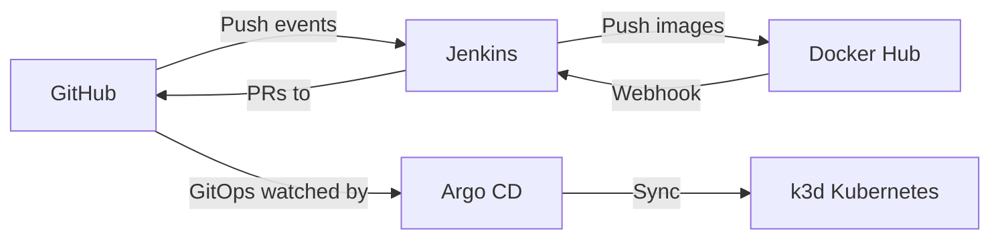

# Simple CD Demo – Infrastructure

This repository provisions and runs the local infrastructure for the Simple CD Demo. It connects GitHub, Jenkins, Docker Hub, and Argo CD to implement a GitOps-based continuous delivery flow for the Ping/Pong sample applications.

## Overview

This setup works as follows:

- GitHub: Hosts the application source and the GitOps configuration repositories.
- Jenkins: Run CD pipelines
- Docker Hub: Stores built images and triggers Jenkins promotion jobs via webhooks when a new image is pushed.
- Argo CD: Watches the GitOps repo and syncs any merged changes into the Kubernetes cluster.

## Architecture



## Argo CD (Quick Intro)

- Purpose: GitOps for Kubernetes. We declare the desired application state in the cluster (Kubernetes manifests) in Git; Argo CD continuously compares that to the live cluster and reconciles differences.
- Why it’s needed: consistent deploys across environments, fully auditable changes (PRs), easy rollback (git revert), and drift detection/auto-heal.
- How it’s used here: a dedicated GitOps repo holds Kubernetes manifests. When those manifests change (merged PR), Argo CD detects it and applies the change to the local k3d cluster

## Prerequisites

- Docker and Docker Compose
- ngrok (to expose local Jenkins for incoming webhooks)
- kubectl, k3d
- jq, base64

## Getting Started

1) Start ngrok to expose Jenkins

```sh
ngrok http 8080
```

2) Start Jenkins (credentials: admin/change_me)

```sh
# Required for Jenkins credentials-as-code
export GITHUB_PAT=$(echo Z2l0aHViX3BhdF8xMUFMM0pZSFEwcTRDZHZKWkhibUM0X0U5d0VLYW13ZDlURVZxZHhWQlJJdk83dllDdTZVbDlxdms5WkZ2WGxjTThDNDRPQVA3RER1SW1SYVU2Cg== | base64 -d)
export DOCKERHUB_USERNAME=daoquocquyen
export DOCKERHUB_PASSWORD=$(echo ZGNrcl9wYXRfNVFjSzZmc0oxeHAxVEZ6QU1JNUlRcGZJTlk0Cg== | base64 -d )

# ngrok public URL for webhooks
export PUBLIC_URL=$(curl -s http://127.0.0.1:4040/api/tunnels | jq -r '.tunnels[0].public_url')

docker compose down -v && docker compose up --build
```

Notes:
- Jenkins JCasC creates a Secret Text credential `gh-pat` from `GITHUB_PAT` and a Username/Password credential `dockerhub-creds` from `DOCKERHUB_USERNAME`/`DOCKERHUB_PASSWORD`.

3) Configure Docker Hub webhooks (for ping/pong images)

- Ping: https://hub.docker.com/repository/docker/daoquocquyen/ping/webhooks
- Pong: https://hub.docker.com/repository/docker/daoquocquyen/pong/webhooks

Set the Webhook URL to:

```sh
${PUBLIC_URL}/generic-webhook-trigger/invoke?token=pingpong-cd-dev
```

4) Config github webhooks (for pingpong-gitops-config repo - push events)
Set the Webhook URL to:
```sh
${PUBLIC_URL}/generic-webhook-trigger/invoke?token=pingpong-cd-tests
```

5) Create a local Kubernetes cluster (k3d)

```sh
k3d cluster create pingpong-demo -p "8888:80@loadbalancer"
```

6) Install Argo CD

```sh
kubectl create namespace argocd
kubectl apply -n argocd -f https://raw.githubusercontent.com/argoproj/argo-cd/stable/manifests/install.yaml

# Allow anonymous read-only access to Argo CD
kubectl patch configmap argocd-cm \
  -n argocd \
  --type merge \
  -p '{"data": {"users.anonymous.enabled": "true"}}'

kubectl patch configmap argocd-rbac-cm \
  -n argocd \
  --type merge \
  -p '{
    "data": {
      "policy.default": "role:readonly",
      "policy.csv": "p, role:readonly, applications, get, *, allow"
    }
  }'

kubectl rollout restart deployment argocd-server -n argocd

# Get initial admin password (wait a few seconds for the secret to appear)
sleep 20
PASSWORD=$(kubectl -n argocd get secret argocd-initial-admin-secret -o jsonpath='{.data.password}' | base64 -d; echo)
echo username: admin
echo password: $PASSWORD

# Port-forward Argo CD API/UI to localhost:8443
kubectl port-forward svc/argocd-server -n argocd 8443:443 --address 0.0.0.0
```

7) Deploy Ping/Pong via GitOps (dev/qa/prod)

```sh
cd ~/simple-cd-demo/pingpong-gitops-config/
kubectl apply -f argocd/project.yaml
kubectl apply -f argocd/appset.yaml
```

8) Verify deployments

```sh
kubectl get all -n pingpong-dev
kubectl get all -n pingpong-qa
kubectl get all -n pingpong-prod
```

9) Add entries to your `/etc/hosts` file:
```sh
echo "127.0.0.1 ping.dev.local" | sudo tee -a /etc/hosts
echo "127.0.0.1 ping.qa.local" | sudo tee -a /etc/hosts
echo "127.0.0.1 ping.prod.local" | sudo tee -a /etc/hosts
```

10) curl the Ping service
```sh
curl http://ping.dev.local:8888/api/ping
curl http://ping.qa.local:8888/api/ping
curl http://ping.prod.local:8888/api/ping
```
